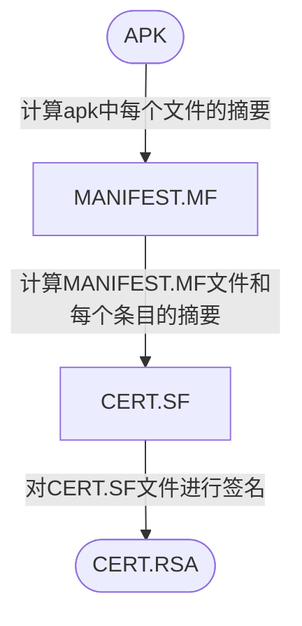

学习路线：


## 逆向工具
**AndroidCrackTool**: mac下Android逆向神器。[Android-Crack-Tool](https://github.com/Jermic/Android-Crack-Tool)  
**Apktool**: apk反编译工具[Apktool](https://github.com/iBotPeaches/Apktool)  
**Jadx**: Java反编译工具[jadx](https://github.com/skylot/jadx)  
**AndroidKiller**: 可视化的安卓应用逆向工具，集Apk反编译、Apk打包、Apk签名，编码互转，ADB通信（应用安装-卸载-运行-设备文件管理）等。  
**Frida**: hook工具[frida](https://github.com/frida/frida)  
**Objection**: Frida的集成化工具[objection](https://github.com/sensepost/objection)  
**FridadexDump**: Frida集成工具，实现一键脱壳[frida-dexdump](https://github.com/hluwa/frida-dexdump)  
**LAMDA**: 一个用于逆向及自动化的辅助框架[lamda](https://github.com/rev1si0n/lamda)
**Fart**: 内存中DexFile结构体完整dex的dump进行脱壳[FART](https://github.com/hanbinglengyue/FART)  
**Inspeckage**: 基于Xposed的动态分析工具[Inspeckage](https://github.com/ac-pm/Inspeckage)  
**DeveloperHelper**: 基于Xposed写的辅助工具，常用于查看Activity名、查看加固类型、查看Activity结构、自动脱壳。  
**UCrack**: 基于Xposed写的辅助工具，集成了自动网络抓包、网络堆栈爆破、文件日志、WebView调试环境、自动脱壳、Native函数注册监控、记录程序自杀堆栈等功能。  
**IDA Pro**: so层调试工具。  

## adb使用
### 基本使用
```shell
#进入shell
adb shell

#连接设备
adb connect ip

#查看连接的设备
adb devices -l  
-l:显示设备信息

#选择设备
adb -s 设备名

#文件传输
#设备到本地：  
adb pull remote local   

#本地到设备：  
adb push local remote

#停止adb服务
adb kill-server

#设置端口转发
adb forward tcp:27043 tcp:27043  
adb forward tcp:27042 tcp:27042

# 清日志
adb logcat -c
```
### Activity 管理器(am)
https://developer.android.com/studio/command-line/adb?hl=zh-cn#am  
```shell
#获取APP包名
adb shell am monitor  
#查看当前应用
adb shell dumpsys window | findstr mCurrentFocus   
```
### 软件包管理器(pm)
https://developer.android.com/studio/command-line/adb?hl=zh-cn#pm
```shell
#查看设备安装包名 
adb shell pm list packages
#查看安装包的路径
adb shell pm path packagename
#安装/卸载Android 应用
adb shell pm install/uninstall packagesname 
#aapt解析包信息
aapt dump badging /Users/macbook/Desktop/app.apk  
aapt d badging packagename
```
### 截图
```shell
screencap filename  
adb shell screencap /sdcard/screen.png
```
### 录制视频
```shell
screenrecord [options] filename  
adb shell screenrecord /sdcard/demo.mp4  
options:  
size widthxheight : 设置视频大小  
--bit-rate rate : 设置视频的比特率  
--time-limit time : 最大录制时长  
--rotate : 将输出旋转 90 度  
--verbose : 在命令行屏幕显示日志信息 
```
## APK签名机制
- **签名**：在Apk中写入一个“指纹”。指纹写入以后，Apk中有任何修改，都会导致这个指纹无效，Android系统在安装Apk进行签名校验时就会不通过，从而保证了安全性。
- **数字摘要**：采用单向Hash函数将需要加密的明文“摘要”成一串固定长度的密文，这一串密文又称为数字指纹，它有固定的长度，而且不同的明文摘要成密文，其结果总是不同的，而同样的明文其摘要必定一致。
- **签名过程**：
	1. **计算摘要**：通过Hash算法提取出原始数据的摘要。
	2.  **计算签名**： 再通过基于密钥（私钥）的非对称加密算法对提取出的摘要进行加密，加密后的数据就是签名信息。
	3. **写入签名**：将签名信息写入原始数据的签名区块内。
- **校验过程**：
	1. **计算摘要**：接收方接收到数据后，首先用同样的Hash算法从接收到的数据中提取出摘要。
	2. **解密签名**：使用发送方的公钥对数字签名进行解密，解密出原始摘要。
	3. **比较摘要**：如果解密后的数据和提取的摘要一致，则校验通过；如果数据被第三方篡改过，解密后的数据和摘要不一致，校验不通过。
- **数字证书**：证书颁发机构，证书颁发机构签名，证书绑定的服务器域名，证书版本、有效期，签名使用的加密算法（非对称算法，如RSA），公钥等。
- **keystore**：秘钥库，对Apk签名时并没有直接指定私钥、公钥和数字证书，而是使用keystore文件，这些信息都包含在了keystore文件中。
- **jarsigner/apksigner**：Android提供了两种对Apk的签名方式，一种是基于JAR的签名方式，另一种是基于Apk的签名方式，它们的主要区别在于使用的签名文件不一样：jarsigner使用keystore文件进行签名；apksigner除了支持使用keystore文件进行签名外，还支持直接指定pem证书文件和私钥进行签名。
### **V1签名机制(JAR签名机制)** 
**签名过程**：

**校验过程**：
1. **首先校验cert.sf文件的签名**：计算cert.sf文件的摘要，与通过签名者公钥解密签名得到的摘要进行对比，如果一致则进入下一步。
2. **校验manifest.mf文件的完整性**：计算manifest.mf文件的摘要，与cert.sf主属性中记录的摘要进行对比，如一致则逐一校验mf文件各个条目的完整性。
3. **校验apk中每个文件的完整性**：逐一计算apk中每个文件（META-INF目录除外）的摘要，与mf中的记录进行对比，如全部一致，刚校验通过。
4. **校验签名的一致性**：如果是升级安装，还需校验证书签名是否与已安装app一致。
### **V2签名机制**
**ZIP文件结构：**
- **数据区**：此区块包含了zip中所有文件的记录，是一个列表，每条记录包含：文件名、压缩前后size、压缩后的数据等；
- **中央目录**：存放目录信息，也是一个列表，每条记录包含：文件名、压缩前后size、本地文件头的起始偏移量等。通过本地文件头的起始偏移量即可找到压缩后的数据；
- **中央目录结尾记录**：标识中央目录结尾，包含：中央目录条目数、size、起始偏移量、zip文件注释内容等。

**V2签名原理：**  
&emsp;V2方案为加强数据完整性保证，不在**数据区**和**中央目录**中插入数据，选择在**数据区**和**中央目录**之间插入一个**APK签名分块**，从而保证了原始zip(apk)数据的完整性。

**定位APK签名方案V2分块：**  
&emsp;APK签名分块包含了4部分：**分块长度**、**ID-VALUE序列**、**分块长度**、**固定magic值**。其中<font color=coral>APK 签名方案 v2分块</font>存放在ID为**0x7109871a**的键值对中。  
&emsp;在进行签名校验时，先找到zip中央目录结尾记录，从该记录中找到中央目录起始偏移量，再通过magic值即可确定前方可能是**APK签名分块**，再通过前后两个分块长度字段，即可确定**APK签名分块**的位置，最后通过ID（0x7109871a）定位<font color=coral>APK签名方案v2分块</font>位置。  

**APK 签名方案v2分块格式：**  
<font color=coral>APK 签名方案 v2分块</font>是一个签名序列，可以使用多个签名者对同一个APK进行签名。每个签名信息中均包含了三个部分的内容：
1. **带长度前缀的signed data**：其中包含了通过一系列算法计算的摘要列表、证书信息，以及extra信息（可选）
2. **带长度前缀的signatures序列**：通过一系列算法对signed data的签名列表。签名时使用了多个签名算法，在签名校验时会是选择系统支持的安全系数最高的签名进行校验
3. **证书公钥**

**摘要计算过程：**  
1. **拆分chunk**：将每个部分拆分成多个大小为 1 MB大小的chunk；
2. **计算chunk摘要**：字节 0xa5 + 块的长度（字节数） + 块的内容 进行计算；
3. **计算整体摘要**：字节 0x5a + chunk数 + 块的摘要的连接（按块在 APK 中的顺序）进行计算。

<font color=#c45a65>中央目录结尾记录中包含了中央目录的起始偏移量，插入APK签名分块后，中央目录的起始偏移量将发生变化。故在校验签名计算摘要时，需要把中央目录的起始偏移量当作APK签名分块的起始偏移量。</font>

**v2 验证过程：**  
1. 找到APK 签名分块并验证以下内容：
	1. APK 签名分块的两个大小字段包含相同的值。
	2. ZIP 中央目录结尾紧跟在ZIP 中央目录记录后面。
	3. ZIP 中央目录结尾之后没有任何数据。
2. 找到APK 签名分块中的第一个APK 签名方案 v2 分块。如果 v2 分块存在，则继续执行第 3 步。否则，回退至使用 v1 方案验证 APK。
3. 对APK 签名方案 v2 分块中的每个 signer 执行以下操作：
	1. 从 signatures 中选择安全系数最高的受支持 signature algorithm ID。安全系数排序取决于各个实现/平台版本。
	2. 使用 public key 并对照signed data 验证 signatures 中对应的 signature。（现在可以安全地解析 signed data 了。）
	3. 验证 digests 和 signatures 中的签名算法 ID 列表（有序列表）是否相同。（这是为了防止删除/添加签名。）
	4. 使用签名算法所用的同一种摘要算法计算 APK 内容的摘要。
	5. 验证计算出的摘要是否与 digests 中对应的 digest 相同。
	6. 验证 certificates 中第一个 certificate 的 SubjectPublicKeyInfo 是否与 public key 相同。
4. 如果找到了至少一个 signer，并且对于每个找到的 signer，第 3 步都取得了成功，APK 验证将会成功。
### V4签名机制
https://www.freebuf.com/articles/terminal/263978.html
