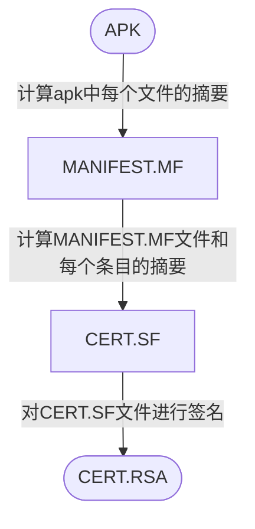

[[11.Android开发]]

## APK基础
### APK签名机制
- **签名**：在Apk中写入一个“指纹”。指纹写入以后，Apk中有任何修改，都会导致这个指纹无效，Android系统在安装Apk进行签名校验时就会不通过，从而保证了安全性。
- **数字摘要**：采用单向Hash函数将需要加密的明文“摘要”成一串固定长度的密文，这一串密文又称为数字指纹，它有固定的长度，而且不同的明文摘要成密文，其结果总是不同的，而同样的明文其摘要必定一致。
- **签名过程**：
	1. **计算摘要**：通过Hash算法提取出原始数据的摘要。
	2.  **计算签名**： 再通过基于密钥（私钥）的非对称加密算法对提取出的摘要进行加密，加密后的数据就是签名信息。
	3. **写入签名**：将签名信息写入原始数据的签名区块内。
- **校验过程**：
	1. **计算摘要**：接收方接收到数据后，首先用同样的Hash算法从接收到的数据中提取出摘要。
	2. **解密签名**：使用发送方的公钥对数字签名进行解密，解密出原始摘要。
	3. **比较摘要**：如果解密后的数据和提取的摘要一致，则校验通过；如果数据被第三方篡改过，解密后的数据和摘要不一致，校验不通过。
- **数字证书**：证书颁发机构，证书颁发机构签名，证书绑定的服务器域名，证书版本、有效期，签名使用的加密算法（非对称算法，如RSA），公钥等。
- **keystore**：秘钥库，对Apk签名时并没有直接指定私钥、公钥和数字证书，而是使用keystore文件，这些信息都包含在了keystore文件中。
- **jarsigner/apksigner**：Android提供了两种对Apk的签名方式，一种是基于JAR的签名方式，另一种是基于Apk的签名方式，它们的主要区别在于使用的签名文件不一样：jarsigner使用keystore文件进行签名；apksigner除了支持使用keystore文件进行签名外，还支持直接指定pem证书文件和私钥进行签名。
### **V1签名机制(JAR签名机制)** ：
**签名过程**：

**校验过程**：
1. **首先校验cert.sf文件的签名**：计算cert.sf文件的摘要，与通过签名者公钥解密签名得到的摘要进行对比，如果一致则进入下一步。
2. **校验manifest.mf文件的完整性**：计算manifest.mf文件的摘要，与cert.sf主属性中记录的摘要进行对比，如一致则逐一校验mf文件各个条目的完整性。
3. **校验apk中每个文件的完整性**：逐一计算apk中每个文件（META-INF目录除外）的摘要，与mf中的记录进行对比，如全部一致，刚校验通过。
4. **校验签名的一致性**：如果是升级安装，还需校验证书签名是否与已安装app一致。
### **V2签名机制**：
(https://blog.csdn.net/zwjemperor/article/details/81051120)
## app逆向
**java加载so文件：**  
System.loadLibrary("so_name")

## ida动态调试
端口转发
```
adb forward tcp:23946 tcp:23946
```