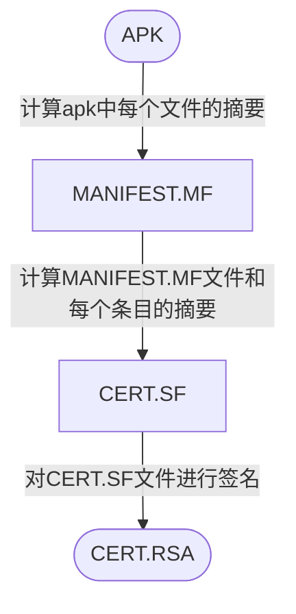

## APK签名机制
- **签名**：在Apk中写入一个“指纹”。指纹写入以后，Apk中有任何修改，都会导致这个指纹无效，Android系统在安装Apk进行签名校验时就会不通过，从而保证了安全性。
- **数字摘要**：采用单向Hash函数将需要加密的明文“摘要”成一串固定长度的密文，这一串密文又称为数字指纹，它有固定的长度，而且不同的明文摘要成密文，其结果总是不同的，而同样的明文其摘要必定一致。
- **签名过程**：
	1. **计算摘要**：通过Hash算法提取出原始数据的摘要。
	2.  **计算签名**： 再通过基于密钥（私钥）的非对称加密算法对提取出的摘要进行加密，加密后的数据就是签名信息。
	3. **写入签名**：将签名信息写入原始数据的签名区块内。
- **校验过程**：
	1. **计算摘要**：接收方接收到数据后，首先用同样的Hash算法从接收到的数据中提取出摘要。
	2. **解密签名**：使用发送方的公钥对数字签名进行解密，解密出原始摘要。
	3. **比较摘要**：如果解密后的数据和提取的摘要一致，则校验通过；如果数据被第三方篡改过，解密后的数据和摘要不一致，校验不通过。
- **数字证书**：证书颁发机构，证书颁发机构签名，证书绑定的服务器域名，证书版本、有效期，签名使用的加密算法（非对称算法，如RSA），公钥等。
- **keystore**：秘钥库，对Apk签名时并没有直接指定私钥、公钥和数字证书，而是使用keystore文件，这些信息都包含在了keystore文件中。
- **jarsigner/apksigner**：Android提供了两种对Apk的签名方式，一种是基于JAR的签名方式，另一种是基于Apk的签名方式，它们的主要区别在于使用的签名文件不一样：jarsigner使用keystore文件进行签名；apksigner除了支持使用keystore文件进行签名外，还支持直接指定pem证书文件和私钥进行签名。
### **V1签名机制(JAR签名机制)** 
**签名过程**：

**校验过程**：
1. **首先校验cert.sf文件的签名**：计算cert.sf文件的摘要，与通过签名者公钥解密签名得到的摘要进行对比，如果一致则进入下一步。
2. **校验manifest.mf文件的完整性**：计算manifest.mf文件的摘要，与cert.sf主属性中记录的摘要进行对比，如一致则逐一校验mf文件各个条目的完整性。
3. **校验apk中每个文件的完整性**：逐一计算apk中每个文件（META-INF目录除外）的摘要，与mf中的记录进行对比，如全部一致，刚校验通过。
4. **校验签名的一致性**：如果是升级安装，还需校验证书签名是否与已安装app一致。
### **V2签名机制**
**ZIP文件结构：**
- **数据区**：此区块包含了zip中所有文件的记录，是一个列表，每条记录包含：文件名、压缩前后size、压缩后的数据等；
- **中央目录**：存放目录信息，也是一个列表，每条记录包含：文件名、压缩前后size、本地文件头的起始偏移量等。通过本地文件头的起始偏移量即可找到压缩后的数据；
- **中央目录结尾记录**：标识中央目录结尾，包含：中央目录条目数、size、起始偏移量、zip文件注释内容等。

**V2签名原理：**  
&emsp;V2方案为加强数据完整性保证，不在**数据区**和**中央目录**中插入数据，选择在**数据区**和**中央目录**之间插入一个**APK签名分块**，从而保证了原始zip(apk)数据的完整性。

**定位APK签名方案V2分块：**  
&emsp;APK签名分块包含了4部分：**分块长度**、**ID-VALUE序列**、**分块长度**、**固定magic值**。其中<font color=coral>APK 签名方案 v2分块</font>存放在ID为**0x7109871a**的键值对中。  
&emsp;在进行签名校验时，先找到zip中央目录结尾记录，从该记录中找到中央目录起始偏移量，再通过magic值即可确定前方可能是**APK签名分块**，再通过前后两个分块长度字段，即可确定**APK签名分块**的位置，最后通过ID（0x7109871a）定位<font color=coral>APK签名方案v2分块</font>位置。  

**APK 签名方案v2分块格式：**  
<font color=coral>APK 签名方案 v2分块</font>是一个签名序列，可以使用多个签名者对同一个APK进行签名。每个签名信息中均包含了三个部分的内容：
1. **带长度前缀的signed data**：其中包含了通过一系列算法计算的摘要列表、证书信息，以及extra信息（可选）
2. **带长度前缀的signatures序列**：通过一系列算法对signed data的签名列表。签名时使用了多个签名算法，在签名校验时会是选择系统支持的安全系数最高的签名进行校验
3. **证书公钥**

**摘要计算过程：**  
1. **拆分chunk**：将每个部分拆分成多个大小为 1 MB大小的chunk；
2. **计算chunk摘要**：字节 0xa5 + 块的长度（字节数） + 块的内容 进行计算；
3. **计算整体摘要**：字节 0x5a + chunk数 + 块的摘要的连接（按块在 APK 中的顺序）进行计算。

<font color=#c45a65>中央目录结尾记录中包含了中央目录的起始偏移量，插入APK签名分块后，中央目录的起始偏移量将发生变化。故在校验签名计算摘要时，需要把中央目录的起始偏移量当作APK签名分块的起始偏移量。</font>

**v2 验证过程：**  
1. 找到APK 签名分块并验证以下内容：
	1. APK 签名分块的两个大小字段包含相同的值。
	2. ZIP 中央目录结尾紧跟在ZIP 中央目录记录后面。
	3. ZIP 中央目录结尾之后没有任何数据。
2. 找到APK 签名分块中的第一个APK 签名方案 v2 分块。如果 v2 分块存在，则继续执行第 3 步。否则，回退至使用 v1 方案验证 APK。
3. 对APK 签名方案 v2 分块中的每个 signer 执行以下操作：
	1. 从 signatures 中选择安全系数最高的受支持 signature algorithm ID。安全系数排序取决于各个实现/平台版本。
	2. 使用 public key 并对照signed data 验证 signatures 中对应的 signature。（现在可以安全地解析 signed data 了。）
	3. 验证 digests 和 signatures 中的签名算法 ID 列表（有序列表）是否相同。（这是为了防止删除/添加签名。）
	4. 使用签名算法所用的同一种摘要算法计算 APK 内容的摘要。
	5. 验证计算出的摘要是否与 digests 中对应的 digest 相同。
	6. 验证 certificates 中第一个 certificate 的 SubjectPublicKeyInfo 是否与 public key 相同。
4. 如果找到了至少一个 signer，并且对于每个找到的 signer，第 3 步都取得了成功，APK 验证将会成功。
### V4签名机制
https://www.freebuf.com/articles/terminal/263978.html

## 签名校验
### 处理签名校验
1. **核心破解**，小米的三方lsp插件 **Cemiuiler**
2. **一键过签名工具**：MT、NP、ARMPro、CNFIX、Modex的去除签名校验功能
3. **io重定向**--VA&SVC：ptrace+seccomp
4. 分析处理签名校验逻辑
### IO重定向
### 常见的校验特征  
- **kill/killProcess**：kill/KillProcess()可以杀死当前应用活动的进程，这一操作将会把所有该进程内的资源（包括线程全部清理掉）.当然，由于ActivityManager时刻监听着进程，一旦发现进程被非正常Kill，它将会试图去重启这个进程。这就是为什么，有时候当我们试图这样去结束掉应用时，发现它又自动重新启动的原因。  
- **system.exit**：杀死了整个进程，这时候活动所占的资源也会被释放。  
- **finish**：仅仅针对Activity，当调用finish()时，只是将活动推向后台，并没有立即释放内存，活动的资源并没有被清理。
### 普通签名校验
```java
private boolean SignCheck() {
    String trueSignMD5 = "d0add9987c7c84aeb7198c3ff26ca152";
    String nowSignMD5 = "";
    try {
        // 得到签名的MD5
        PackageInfo packageInfo = getPackageManager().getPackageInfo(getPackageName(),PackageManager.GET_SIGNATURES);
        Signature[] signs = packageInfo.signatures;
        String signBase64 = Base64Util.encodeToString(signs[0].toByteArray());
        nowSignMD5 = MD5Utils.MD5(signBase64);
    } catch (PackageManager.NameNotFoundException e) {
        e.printStackTrace();
    }
    return trueSignMD5.equals(nowSignMD5);
}
```
### IPC协议获取签名信息
(https://bbs.kanxue.com/thread-278982.htm#msg_header_h2_1)
